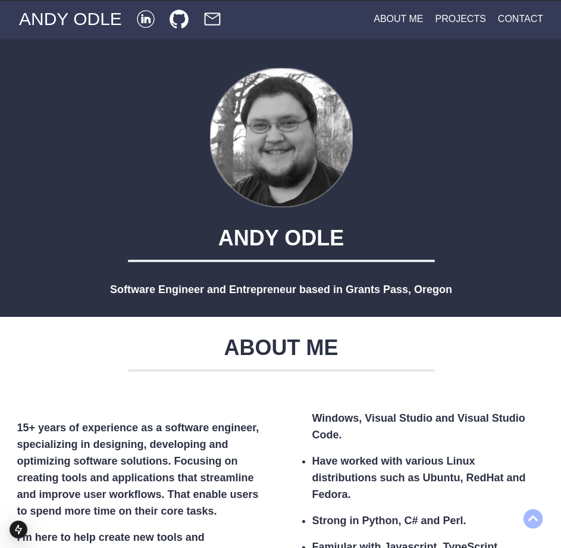

<p align="center">
    
</p>

# Portfolio Website
My personal portfolio [andy-portfolio-net.app](https://lazinaround.com) which features some of my current projects and showcases some of my technical skills.

This Portfolio was inspired by [JeromeLachaud's](https://jeromelachaud.com/freelancer-theme/) freelancer-theme.

This project was built using.  
* Next.js
* TypeScript
* TailwindCSS 
* VsCode
* Gimp

# Getting Started
Clone down this repository and install the required tools.

Required Tools:  
* nodejs
* npm - Node Package Manager
* nvm - Node Version Manager

# Install Project Dependices
Install project dependices listed in the package.json.
```
npm install
```

# Run Development Server  
1. Open the project folder.
2. Navigate to /Source/.
3. Launch the portfolio app in development mode.
```
npm run dev
```
# Bild Your Own Next.js Project From Scratch

1. Use npx to create starter project in the current directory.  
```
npx create-next-app@latest ./
```
2. Select **Yes** to use _TypeScript_.
3. Select **Yes** to use _ESLint_.
4. Select **Yes** to use _Tailwind CSS_.
5. Select **No** to not use _'src/'_ directory.
6. Select **Yes** to use _App Router_. 
7. Select **Yes** to use _Turbopack_.
7. Press **Enter** to use the default _import alias_.